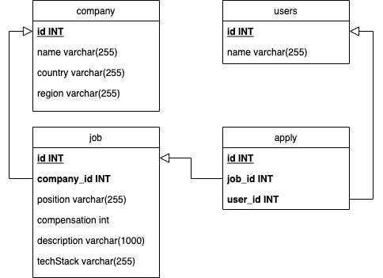

# wanted-pre-onboarding-backend
[과제테스트] 원티드 프리온보딩 10월 백엔드 인턴십

- 이름 : 김유빈

## 목차
- [기술스택](#기술스택)
- [ERD](#ERD)
- [API 설계](#API-설계)
- [고려사항](#고려사항)

## 기술스택
- Java
- Spring Boot
- JPA
- MySQL

## ERD



## API 설계

### 0. [포스트맨 API 명세서](https://documenter.getpostman.com/view/9434544/2s9YR9XXzd)

### 1. 채용공고 등록

***Request***

```json
POST /jobs
Content-Type: application/json

{
	"companyId" : 1,
	"position" : "백엔드 주니어 개발자",
	"compensation" : 1000000,
	"description" : "원티드 랩에서 백엔드 주니어 개발자를 채용합니다. 자격요건은..",
	"techStack" : "Python"
}
```

| 필드           | 타입      | 설명     |
|--------------|---------|--------|
| companyId    | Integer | 회사 id  |
| position     | String  | 채용 포지션 |
| compensation | Integer | 채용 보상금 |
| description  | String  | 채용 내용  |
| techStack    | String  | 사용 기술  |

***Response***

```json
HTTP/1.1 201 Created
Location: /jobs/1
```

### 2. 채용공고 수정

***Request***

```json
PUT /jobs/1
Content-Type: application/json

{
	"position" : "백엔드 주니어 개발자",
	"compensation" : 1500000,
	"description" : "원티드 랩에서 백엔드 주니어 개발자를 '적극' 채용합니다. 자격요건은..",
	"techStack" : "Python"
}
```

| 필드           | 타입      | 설명     |
|--------------|---------|--------|
| position     | String  | 채용 포지션 |
| compensation | Integer | 채용 보상금 |
| description  | String  | 채용 내용  |
| techStack    | String  | 사용 기술  |

***Response***

```json
HTTP/1.1 200 OK
```

### 3. 채용공고 삭제

***Request***

```json
DELETE /jobs/1
```

***Response***

```json
HTTP/1.1 200 OK
```

### 4. 채용공고 목록 조회

***Request***

```json
GET /jobs?page=1&size=10
```

| 파라미터 | 타입      | 설명                  |
|------|---------|---------------------|
| page | Integer | 화면에 띄울 페이지 (1부터 시작) |
| size | Integer | 화면에 띄울 컨텐츠 개수       |

***Response***

```json
HTTP/1.1 200 OK

{
	"page" : 1,
	"size" : 10,
	"hasNext": false,
	"content" : 
		[
			{
				"jobId" : 1,
				"companyId" : 1,
				"companyName" : "원티드랩",
				"country" : "한국",
				"region" : "서울",
				"position" : "백엔드 주니어 개발자",
				"compensation" : 1500000,
				"techStack" : "Python"
			},
			{
				"jobId" : 2,
				"companyId" : 5,
				"companyName" : "네이버",
				"country" : "한국",
				"region" : "판교",
				"position" : "Django 주니어 개발자",
				"compensation" : 1000000,
				"techStack" : "Django"
			},
			...
		]
}
```

| 필드      | 타입      | 설명                 |
|---------|---------|--------------------|
| page    | Integer | 요청한 페이지            |
| size    | Integer | 요청한 페이지에 띄울 컨텐츠 개수 |
| hasNext | Boolean | 다음 페이지 데이터 존재 여부   |
| content | List    | 데이터 목록             |

| 필드           | 타입      | 설명       |
|--------------|---------|----------|
| jobId        | Integer | 채용 공고 id |
| companyId    | Integer | 회사 id    |
| companyName  | String  | 회사명      |
| country      | String  | 국가       |
| region       | String  | 지역       |
| position     | String  | 채용 포지션   |
| compensation | Integer | 채용 보상금   |
| techStack    | String  | 사용 기술    |

### 5. 채용공고 조회

***Request***

```json
GET /jobs/1
```

***Response***

```json
HTTP/1.1 200 OK

{
  "jobId" : 1,
  "companyId" : 1,
  "companyName" : "원티드랩",
  "country" : "한국",
  "region" : "서울",
  "position" : "백엔드 주니어 개발자",
  "compensation" : 1500000,
  "description" : "원티드 랩에서 백엔드 주니어 개발자를 채용합니다. 자격요건은..",
  "techStack" : "Python",
  "others" : [
    2, 3, 4, ...
  ]
}
```

| 필드           | 타입      | 설명              |
|--------------|---------|-----------------|
| jobId        | Integer | 채용 공고 id        |
| companyId    | Integer | 회사 id           |
| companyName  | String  | 회사명             |
| country      | String  | 국가              |
| region       | String  | 지역              |
| position     | String  | 채용 포지션          |
| compensation | Integer | 채용 보상금          |
| description  | String  | 채용 내용           |
| techStack    | String  | 사용 기술           |
| others       | List    | 회사가 올린 다른 채용 공고 |

### 6. 채용공고 지원

***Request***

```json
POST /jobs/1/apply
Content-Type: application/json

{
	"userId" : 1
}
```

| 필드     | 타입      | 설명     |
|--------|---------|--------|
| userId | Integer | 사용자 id |

***Response***

```json
HTTP/1.1 200 Ok
```

## 고려사항

### 1. Job Entity 에서 Company Entity 참조 시 객체 참조

- 현재 기획되어 있는 채용 공고 조회 API 들의 경우 모두 회사의 정보를 필요로 합니다.
- 또한 도메인 특성 상 채용 공고의 경우 회사의 정보를 기반으로 생성됩니다.
- 즉, 채용 공고 조회 시 매번 회사의 정보를 호출할 가능성이 높기 때문에 아이디 참고가 아닌 객체 참조로 연결하였습니다.

### 2. (5번) 채용 상세정보 조회 시 Repository 에서 id 리스트 조회

- 채용 상세정보 조회 시 해당 채용을 올린 회사의 다른 채용 공고 아이디 목록이 포함되어 있습니다.
- 현재 프로젝트의 Entity 는 Job 이 Company 를 객체로 참조하고 있습니다.
- 채용 공고 조회 시 객체로 조회할 경우 Company 도 같이 조회됩니다.
- 불필요한 값 조회를 방지하기 위해 채용 상세정보에 있는 아이디 목록 조회 시 Repository 계층에서 객체가 아닌 Long(ID) 타입으로 조회해왔습니다.

### 3. Apply Entity 에서 Job 과 Company 아이디 참조

- apply 는 지원 내역을 다루는 엔티티로 채용 공고와 사용자 정보를 가지고 있습니다.
- 지원 내역의 경우 ‘채용 공고’ 의 정보는 필요로 할 가능성이 매우 높으나
- 현재 요구사항 만으로는 어떻게 확장될 지 정확하게 예측할 수 없기 때문에 아이디 참조로 연결하였습니다.
    - 다음과 같은 이유로 객체 참조보다 아이디 참조를 선호하는 편입니다.
        - 객체를 참조하던 코드에서 아이디로 수정하는 것보다 반대로 활용하는 코드로 수정하는 편이 더 간단합니다.
        - 이미 객체 참조를 하고 있는 상태에서 불필요한 상황이라는 것을 인식하기 어렵습니다.
